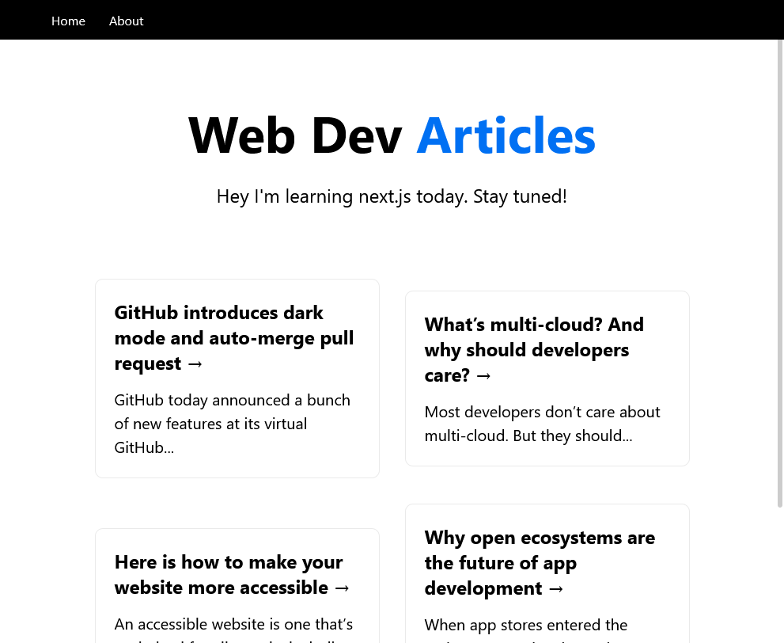

---

This is a [Next.js](https://nextjs.org/) project bootstrapped with [`create-next-app`](https://github.com/vercel/next.js/tree/canary/packages/create-next-app).

## Starting up the project

First, run the development server:

```bash
npm run dev
```

Open [http://localhost:3000](http://localhost:3000) with your browser to see the result.

## Custom API description
[API routes](https://nextjs.org/docs/api-routes/introduction) can be accessed on [http://localhost:3000/api/articles](http://localhost:3000/api/articles).

Sample API is created with articles. This endpoint can be edited in `pages/api/articles`.

The `pages/api` directory is mapped to `/api/*`. Files in this directory are treated as [API routes](https://nextjs.org/docs/api-routes/introduction) instead of React pages.

## Topics covered in the sample project
- Setting up and Getting started
- Pages and Routing
- Using the inbuild Head to add meta tags or links in the head tag
- Creating a layout and using CSS Modules
- Styled JSX, eq: Component level styles (conditional css - /components/Header.js)
- Custom Document (_document.js)
- Data Fetching
- Using getStaticProps() (/pages/index.js)
- Nesting Routes (Article pages)
- getServerSideProps() (/pages/articles/[id])
- getStaticPaths() with getStaticProps()
- API Routes, we created a articles route at /api/articles 